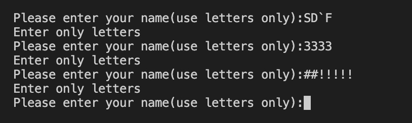
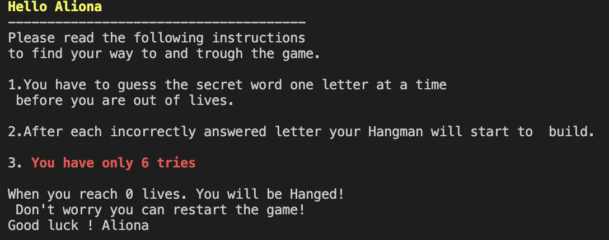
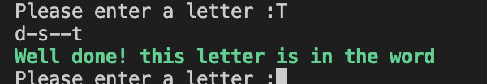
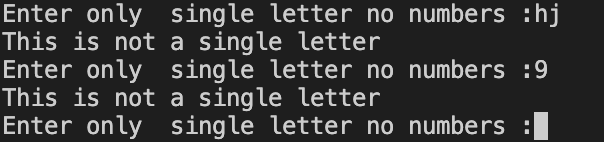
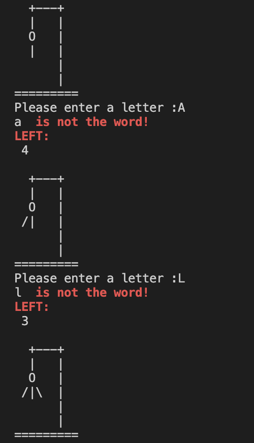
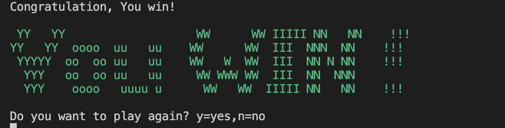
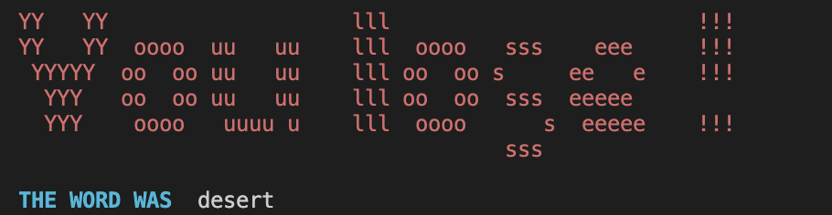
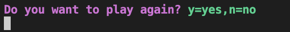
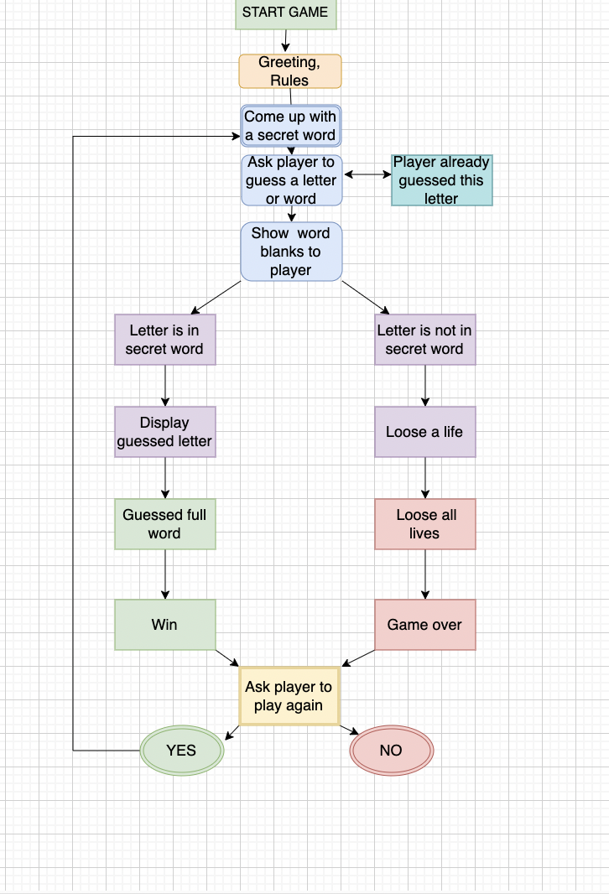

# Game Hangman
***

[Link for Repository](https://github.com/Aliona83/game-hangman)

[Link for Life game](https://hangman-game83.herokuapp.com/)

## Contents
***
 * Table of Contents
 * Project Overview
    * Goals
 * Features
 * Technologies Used
 * Design
    * Colour Scheme
    * Graphics
    * Flowchart
 * Deployment
 * Credits 
 * Testing

## Project Overview
***

In this project, I have made a hangman game using Python. Hangman is a popular word game. This game is a word game where the goals is to guess the word by selecting different letters until the word is complete.  Game is familiar to us since childhood, only we used paper and a pen for this game. This game will be interesting for adults and children, as the words are matched with different difficulties. The player will get a word and tries to guess it by suggesting letters. The player has the length of the word that has to guess, with some lifelines. You have 6 guesses to guess a letter or a word before you run out of life.

## Goals
***
#### Creater Goals
* Create a game that is easy to control.
* I want to create a bright game with graffiti and text in different colours.
* The level of play game should be average for both adults and children.
* To be able to choose to play again or quit.
* To be clearly informed how to play the game.
#### Visiter Goals
* Want to enter user name.
* I want to be able to see how many  tries I still left.
* Get warned in red if an incorrect letter was entered or such a letter was entered twice.
* Be able play again or quit the game.
* I want to get feedback if a correct or incorrect guess is made.

## Features
***
### Existing features
 ### Welcome page

   At the begining of the game user will see bright welcome grafitti and after this user starts the game. 
   * 
   
   The username most enter  only letters,if the user will enter number or symbol , an error message will shows up.
   * 
    
    
 ### Start Game

 When the user will type his name will appare welcome message with his name. Below will appear the rules of the game with which the user can get acquainted before starting play game Hangman. Each line of rules will appear gradually so the player can slowly read all rules and understand.

   * 
   * 
   
   
 ### Hangman Game
  
  The player entering each time the correct letter will see a message that the letter is correct and the structure of the word with already guessed letters.

   * 
   
   Also, for each incorrectly guessed letter, player will clearly see that letter was incorrect and hangman structure will appear, the player will also see how much life he still has left.

   * 
   
   To keep the game fair the player can only enter one letter at a time, he is not allowed to enter any numbers and if he leaves an empty blank, he will not be able to move forward until he presses any letter.

   * 
    
    
 ###  Hangman End Game

  If the player guessed the full word, he will receive congratulations with the bright symbol "You Win"
   * 
    
   The same thing will appear for the player if he did not guess the word and lost all his lives, he will get a symbol "You Lose", underneath he will also be notified which word he did not guess.
   * 

   After winning or losing the player will be asked to play again,he will have two option n= no and y = yes. If the player wants to play again and he will press "y" ,the game will start over again. 
   * 
   
   
## Technologies used
***
   * [Python]() for the main game play.
   * [GitHub]() as remote repository.
   * [Heroku]() to deploy the website.
   * [Diagram.net](https://app.diagrams.net/) to make a algorithm  for the game.
   * [Patorjk.com]() for converting text to acii art.
   * [Colorama](https://pypi.org/project/colorama/) For producing colored terminal text.
   * [Programize](https://www.programiz.com/python-programming/time/sleep) - Found the necessary tutorials and examples for my project.
   * [Random words](https://randomwordgenerator.com/)
   
## Design
***
For this game, I wanted to use other colours so that I could emphasize the necessary information for the player, for this I used Colorama.
### Flowchart

This flowchart contains the entire structure of the game. The flowchart was created in stages of how the game will run. This diagram help me to think how I will start coding. flow maps out the order of everything that can happend in the Hangman game completely. 

## Deployment
***
This project was deployed using Code Institute's mock terminal for Heroku. Below are the steps I followed to be able to deploy the terminal to the website:

  1.Create a new Heroku app on the Heroku website.
  2.Set config vars: Port and give it a value of 8000.
  3.Set buildpacks to Python and NodeJS in that order.
  4.Link the Heroku app to the repository on GitHub.
  5.Click on Deploy.

### Create Repository
  
For this I used Github.

 * Go to your profile, and press on "Repositories".
 * Press "New" (Big green button).
 * There I chose to use a template from Code Institute to have everything I needed for this project.
 * Named my project "daily-math".
 * Then clicked on "Create repository".
 * Onces created, I opened the repository and clicked on "Gitpod" to create a new workplace.

### Fork Repository on GitHub

A copy of the GitHub Repository can be made by forking the GitHub account. Changes can be made on this copy without affecting the origional repository.

* Log in to GitHub and locate the repository in question.
* Locate the Fork button which can be found in the top corner, right-hand side of the page, inline with the repository name.
* Click this button to create a copy of the origional repository in your GitHub Account.

###  To Clone The Repository on GitHub

* Click on the code button which is underneath the main tab and repository name to the right.
* In the "Clone with HTTPS' section, click on the clipboard icon to copy the URL.
* Open Git Bash in your IDE of choice.
* Change the current working directory to where you wan the cloned directory to be made.
* Type git clone, and then paste the URL copied form GitHub.
* Press enter and the clone of your repository will be created.

## Credits
***
 * Slack community for information and also the few that helped me with the issues what I got. 
 * My mentor Mitko_mentor for continuous helpful feedback, motivating, help when struggling with parts of my code.
 * [NPStation](https://www.youtube.com/watch?v=MtYw0RaZ4B0&t=455s) I watched this video a couple of times, I came up with what I needed for the game, how the game will look and how I will make it.
 * [GreeksforGreeks](https://www.geeksforgeeks.org/indentation-in-python/) This helped me learn how to write code, how to create functions, and how to solve problems with indentations, also thanks to this site I found how I can fix the bug of not allowing the player to type two letters at the same time.
 * [linkedIn]()https://www.linkedin.com/learning/first-look-python-3-9/new-pep-language-features?autoplay=true There I got first my knowledge about Python.
## Bugs
***
Bugs and erros econountered during coding of project were solved through contiuned testing throught the development. Using print statements and through git terminal python3 run.py. Testing code to see what the code was doing and how it was responding as well as locating any errors that might be brought up in the problems part of git. Code was also run through the PEP8 during development for the same reason.
 

  * I did as new to python have many syntax errors as wells as indent errors and white space errors.
  * Some funtion didn't work as they will build wrong.
  * 
  * 
  * 
## Testing
   Expected                                                                           
  1. The player must enter his name before continuing to play.(Pass)
  2. The player must use only letters to enter his name.(Pass)
  3. The player can't enter 2 or more letters at the same time. (Faile) 
  4. Checked can player go forward if he empty input.(Faile)                                                                
              
              
              
    Outcomes  
   * The player must enter a name if he wants to procced to the game, he will be ask to use only letters.
   * If the player enters numbers or other symbols in his name, he will be ask again to use only letters.
   * The code had been change, so that the player could enter only one letter at the time.
   * If player has an empty field and he press enter, he will be asked to get a single letter.
###

***
* PEP8  Python Validator 

